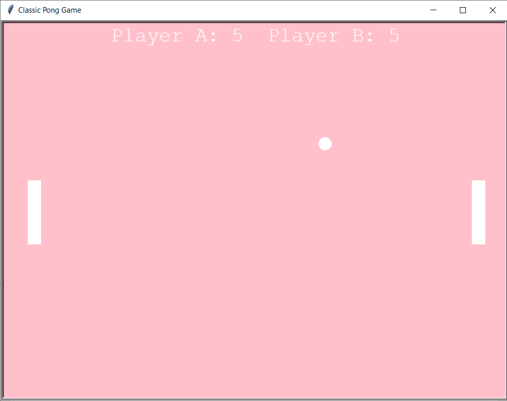

# Pong-game-in-python
A local two player, classic pong game built in python using Turtle module.

## How to run the game

1. Download the pong.py file from the pong folder.
2. On your terminal/command prompt, cd into the folder you saved the file in and enter the command "python pong.py"
3. To move the left bar up and down use "w" and "s" and for the right bar "up" and "down" navigation keys respectively. Note that your caps lock should be off.
